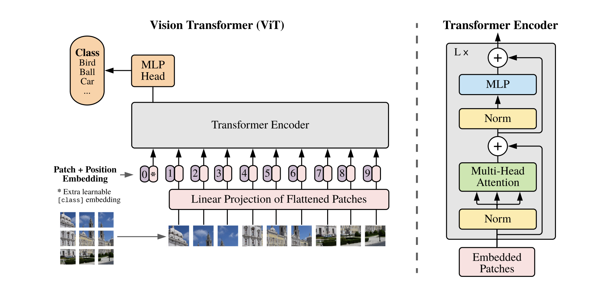

# Vision Transformer (ViT)

Tensorflow implementation of the Vision Transformer (ViT) presented in 
[An Image is Worth 16x16 Words: Transformers for Image Recognition at Scale](https://openreview.net/pdf?id=YicbFdNTTy),
where the authors show that Transformers applied directly to image patches and pre-trained on large datasets work really well on image classification.

<p align="center">
    
</p>

## Install dependencies

Create a Python 3 virtual environment and activate it:

```bash
virtualenv -p python3 venv
source ./venv/bin/activate
```

Next, install the required dependencies:

```bash
pip install -r requirements.txt
```

## Train model

Start the model training by running:

```bash
python train.py --logdir path/to/log/dir
```

To track metrics, start `Tensorboard`

```bash
tensorboard --logdir path/to/log/dir
```

and then go to [localhost:6006](localhost:6006).

## Citation

```bibtex
@inproceedings{
    anonymous2021an,
    title={An Image is Worth 16x16 Words: Transformers for Image Recognition at Scale},
    author={Anonymous},
    booktitle={Submitted to International Conference on Learning Representations},
    year={2021},
    url={https://openreview.net/forum?id=YicbFdNTTy},
    note={under review}
}
```
